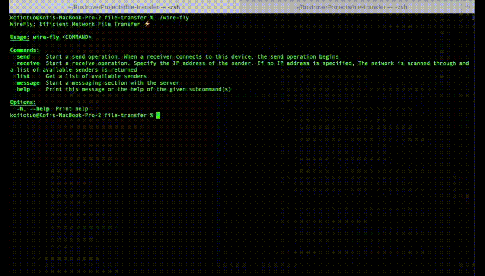

# From Sender to Receiver: Rust's Approach to Local File Transfers

Welcome to the repository for the Rust implementation based on the article *From Sender to Receiver: Rust's Approach to Local File Transfers*. We appreciate you taking the time to explore our work!

## Overview

This repository hosts the source code and various binaries for a file transfer application built in Rust. The application allows for seamless transfer of files locally, providing efficient and reliable functionality.

### Features

- Fast and secure file transfer.
- Cross-platform compatibility with binaries available for macOS, Windows, and Linux.
- Easy integration with other programs through the provided library.

## Getting Started

To get started, download the appropriate binary for your operating system:

- [macOS Binary](https://buymeacoffee.com/otuokofi/e/249247)
- [Windows Binary](https://buymeacoffee.com/otuokofi/e/249262)
- [Linux Binary](https://buymeacoffee.com/otuokofi/e/249264)

Once downloaded, simply execute the binary to start using the application.

## Source Code

You can find the source code for the file transfer application in the [source code directory](https://buymeacoffee.com/otuokofi/e/249272). The source code contains both the binaries and a library, making it easy to integrate with other programs such as Android apps.

Feel free to explore the source code and contribute to the project!

## Demo

Check out this short gif showcasing the functionality of the application:



## Usage

The application is simple to use. Here's a basic example of how to transfer a file using the command line:

```
$ ./wire-fly send -f path-to-your-file
$ ./wire-fly receive
```

For more detailed usage instructions, please refer to the documentation included in the repository.

## Integration

The source code includes both the binary and a library, making it easy to integrate the file transfer functionality into your own projects. Whether you're building desktop applications, web services, or even Android apps, you can leverage the power and efficiency of Rust for local file transfers.

## Contributing

We welcome contributions from the community! Whether it's bug fixes, feature enhancements, or just feedback, we appreciate any help in making this project even better. Please refer to the [Contribution Guidelines](CONTRIBUTING.md) for more information.

## License

This project is licensed under the [MIT License](LICENSE), so feel free to use it however you like!

---

If you have any questions or feedback, don't hesitate to reach out. Thank you for your interest in our Rust file transfer application!
